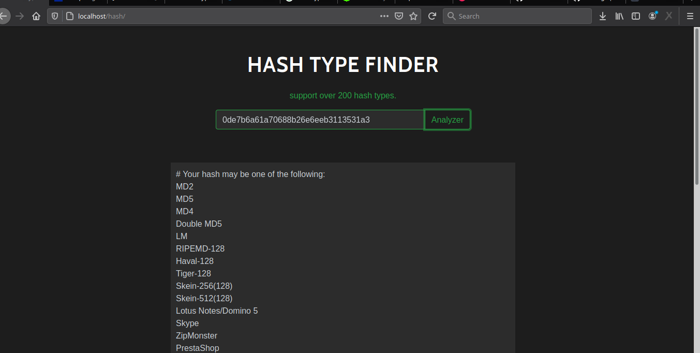

# Password-Hash-Identification
A php tool to determine the type of hash. support over 200 hash types.
 The tool can look at the characters that make up the hash to possibly identify which type of hash it is and what it may be used for.
   - MD5
    - SHA1 (SHA128)
   - SHA2 (SHA256)
   - SHA512
   - MySQL
   - MD5 Wordpress
   - MD5 phpBB
   - BCRYPT
   - MD5-Crypt
  -  Oracle
 -   SHA-Crypt
 -   PHPS
 -   and more…

